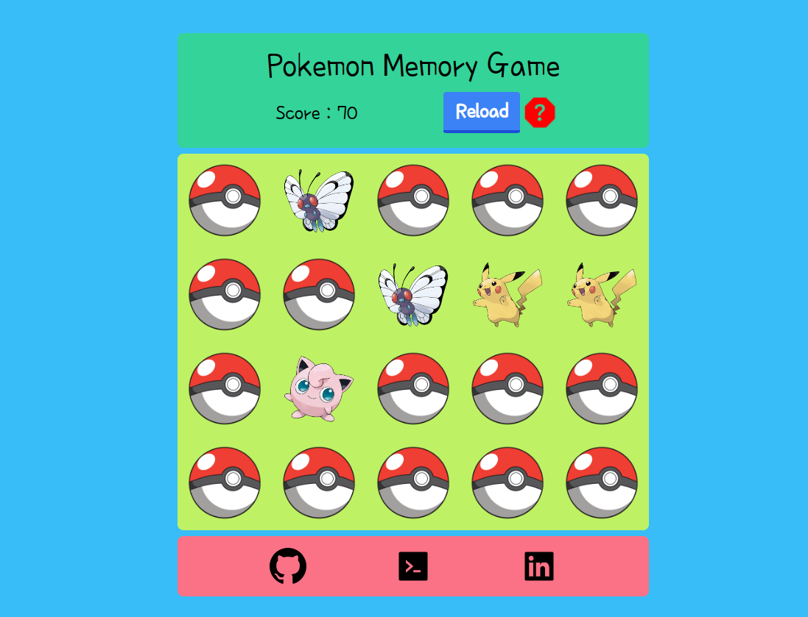

# Pokemon Memory Game

A memory game played by finding the match of Pokemon. It helped me understand React, Redux, and how to make animation using framer motion on apps.

[Live Demo](https://pokemon-memory-game-cryptobcu.netlify.app/)

## Packages I use...

* @reduxjs/toolkit
* react-redux
* framer-motion
* tailwindcss

---
Go to relevant directory and install dependencies with..
> npm install

then run the project with..
> npm run start

---
## Preview 
